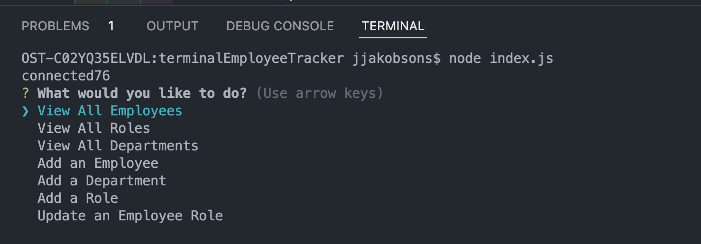

  # terminalEmployeeTracker

  
  
  

  ## Table-Of-Contents 

  * [Description](#description)
  * [Installation](#installation)
  * [Usage](#usage)
  * [License](#license)
  * [Contributing](#contributing)
  * [Screenshot/Recording](#screenshotrecording)
  * [Questions](#questions)

  ## Description

  This application will track your employees using a command line application where you can track different employees, their roles, salaries, what department they belong to, and who their manager is! 

  ## Installation

  To install this code, first clone the repo. Then install npm and Inquirer, MySql2, and console.table. Then within mysql, work through setting up the db using the queries in the db, schema, and seeds files. 

  ## Usage

  Once installed, type 'node index.js' in the command line and you will be prompted to choose your actions! 

  ## License

  This project is covered under the following license: 
  MIT

  ## Contributing 
  NPM Packages used: 
  Node, Inquirer, MySql2, console.table

  ## Screenshot/Recording
  

  Link to a recording to showcase the functionality: https://drive.google.com/file/d/1Dg29ANWB2G0NaHUOGftAYeZ6qGa204g8/view 

  ## Questions 

  Any questions? Reach out to me via GitHub or Email!  
  [Github](https://github.com/jjakobsons87)  
  [Email](mailto:jjakobsons87@gmail.com)
  